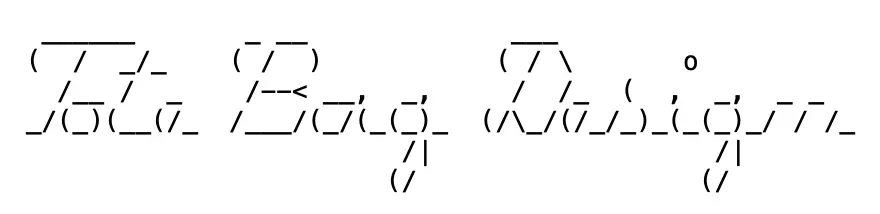
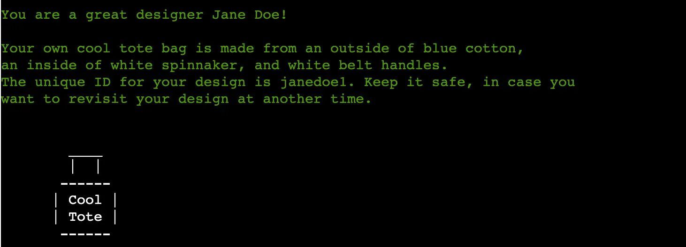
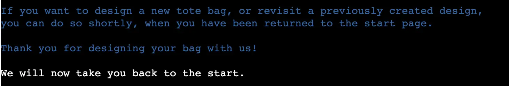
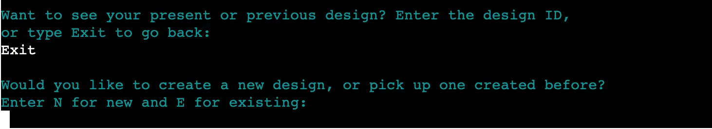
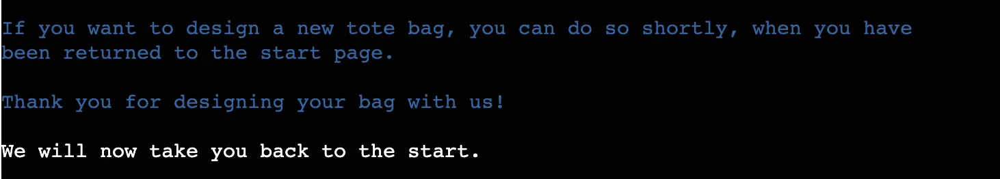
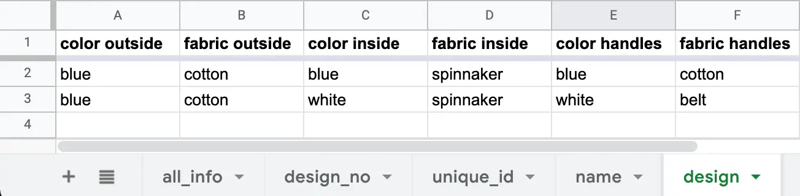
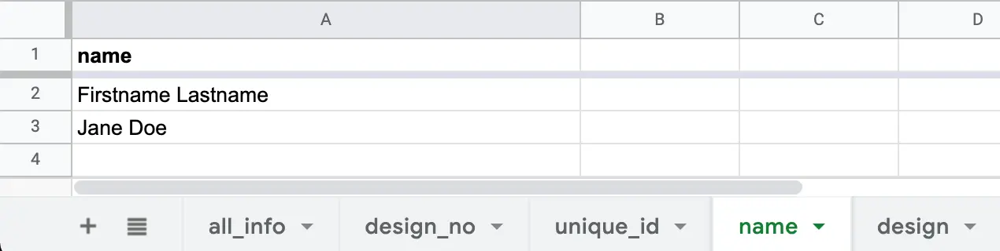
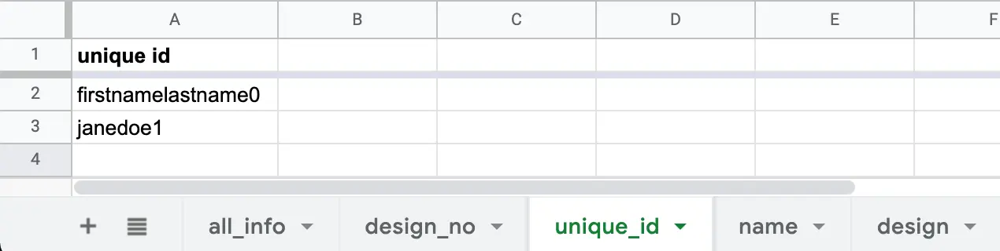
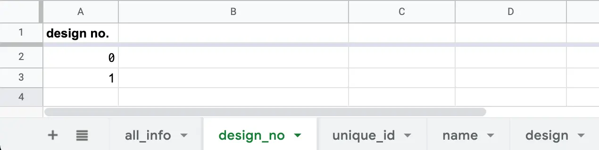
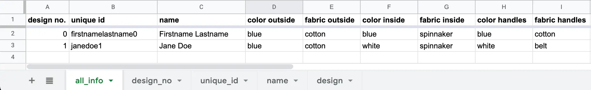

# Design Your Own Tote Bag

Design Your Own Tote Bag is an interactive command line application that aims to give people a possibility to design a custom made tote bag out of reused material. The app iterates through a number of questions regarding fabrics and colors and, based on the user responses, a unique tote bag is created and presented to the user at the end.

The app is targeted towards people who are interested in sustainable solutions and design and use their own bag when shopping or carrying things around. 

Design Your Own Tote Bag will come in handy for those who want a unique tote bag that they have designed themselves. The inspiration comes from my daughter's small business that sews tote bags from old spinnakers, scrap furnishing fabrics and old textile belts.

A link to the live application can be found [here](https://design-your-own-tote-bag.herokuapp.com/), and a link to the repository [here](https://github.com/MarieCHessler/design-your-own-tote-bag).

 

## Table of contents
1. [UX](#ux)
    * [User needs](#user-needs)
    * [Owner goals](#owner-goals)

2. [Design](#design)
    * [Color palette](#color-palette)
    * [Structure](#structure)

3. [Features](#features)
    * [Introduction with logo and welcome](#introduction-with-logo-and-welcome)
    * [Choice between new and existing design](#choice-between-new-and-existing-design)
    * [New design section](#new-design-section)
    * [Existing design section](#existing-design-section)
    * [Worksheets](#worksheets)
    * [General features](#general-features)
    * [Features for the future](#features-for-the-future)

4. [Technology used](#technology-used)

5. [Testing](#testing)
    * [PEP8](#pep8)
    * [User needs fulfilment](#user-needs-fulfilment)
    * [Live testing](#live-testing)

6. [Bugs](#bugs)
    * [Fixed bugs](#fixed-bugs)
    * [Known issues](#known-issues)

7. [Deployment](#deployment)
    * [Heroku](#heroku)

8. [Credits](#credits)
    * [Content](#content)
    * [Special thanks to](#special-thanks-to)

 

## UX

### User needs
**As a user, I would like a program that:**
* Is easy to understand and use.
* Has an appealing layout.
* Saves the data in a spreadsheet, so it is possible to return to previous designs.
* Shows me the result at the end of the design process.
* Explains how I can return to a previous design.

### Owner goals
**As a program owner, I would like to create a tool that:**
* Helps the user to create a tote bag in a unique design.
* Is easy to understand and use and has an appealing look.
* Validates the data to make sure the result is correct and easy to understand.
* Saves the data and can return the design to the user, both straight away and later.

## Design

 

### Color palette
* The colors that have been used in this application were enabled using the Colorama and Termcolor libraries.
    * **Blue** for information, such as the introduction and the information and instructions at the end.
    * **Cyan** for questions to the user.
    * **Green** for comments on choices and final design.
    * **White** is the standard color, which is left unchanged for user input and save messages.
    * **Red** for error messages.
* The colors are chosen to give a good contrast, yet be comfortable for the user's eyes, on a black background. 
* Blue, cyan, and green match each other well, and white is a good complement.
* Red sticks out and therefore is a good choice to have the user react to the message.
* The color library [Colorama](https://pypi.org/project/colorama/) is installed using *pip install colorama* and then used by importing and calling *init* from the library in the relevant files. Calling init() is necessary for Colorama and Termcolor to work properly on Windows.
* The color library [Termcolor](https://pypi.org/project/termcolor/) is installed using *pip install termcolor* and then used by importing and calling *colored* from the library in the relevant files.

### Structure
A structure for Design Your Own Tote Bag was drafted on paper at the beginning of the project process, and later improved using Lucidchart, to make it more appealing and easier to understand.

The flowchart shows the different steps and checks the program follows, based on the different choices the user makes along the way.

 

 

### ASCII logo
* An ASCII logo saying Tote Bag Design was created in ASCII Art on [patorjk.com](https://patorjk.com/software/taag/#p=display&f=Santa%20Clara&t=Tote%20Bag%20Design), please see the picture with black text on white background.
* The logo was later modified to become sleeker and better adjusted to PEP8. One backslash had to be kept, though, for the D to keep its shape. This is the logo used in the app, please see the picture with white text on black background.

 

## Features
The features described below have been implemented for the user to have a pleasant experience.

### Introduction with logo and welcome
* When starting the program an ASCII ART logo, showing the name Tote Bag Design, appears. This helps the user know that he or she is in the right place. 
* Below the logo there is a headline in bold, welcoming the user, and an introduction with a bit of information about what the company does and what the user can do in the application. With this information, the user is prepared when it is time to make the first choice.

 

### Choice between new and existing design
* The first choice the user makes is if he or she wants to create a new design or pick up one that has been created earlier. 
* Giving the user this choice is important since he or she may already have a design that he or she is happy with.

 

### New design section
In the New design section, the user name is collected for personification and recapture of design. The fabric and color choices the user makes are used to create the design. A design number and a unique design ID are created in the background. At the end of the section, the user is presented with the custom-designed tote bag and a unique design ID that can be used to access the design at a later time. 

 

**Name input**
* In the first part, an intro message is shown and the user is then asked to enter his or her name. 
* A personalized welcome message with the name appears to make the user feel special.
* From the first and last name, a full name is created and passed to a Google Sheets worksheet called *name* to be stored.
* If the user enters nothing or other characters than letters, an error message appears, and the user is returned to the question.
* For incorrectly entered characters, the error message returns what the user has entered and asks him or her to enter a name in letters.

 

**Fabric and color choices**
* In the second part, the user is asked to choose between predefined choices of fabrics and colors for the outside, the inside, and the handles of the tote bag.
* For each fabric and color a comment that supports the choice appears, to encourage the user to continue.
* When the choices are made, they are passed to a Google Sheets worksheet called *design* to be stored.
* The user is made aware of the choices being saved by messages shown after all the choices are made.
* If the user enters nothing or other choices than the predefined ones, an error message appears, and the user is returned to the question.
* For all the fabric and color choices, the error message returns what the user has entered, shows the valid choices, and asks him or her to enter the choice in letters.

 

**Design number and ID creation**
* For the user to be able to access the design at a later time, some kind of identification is needed. This is created from a combination of the user name and the design number.
* The design number is created by collecting the previous design number from the Google Sheets worksheet called *design_no*, incrementing it by one, and sending the new number back to the correct row in the worksheet.
* The user name is collected from the Google Sheets worksheet called *name*, the whitespace is removed, and all letters are made lower case.
* The name and number are combined according to the logic firstnamelastname1 and passed to the Google Sheets worksheet called *unique_id*.
* The user is made aware of the number and ID being saved through messages shown after all the choices are made.

 

**Presentation of the design**
* In the final part, the user is presented with his or her design, including an ASCCI image.
* All the data from the different worksheets have automatically been copied into a single worksheet, called *all_info*, from which it is now collected and presented to the user.
* In the message, the user is commended for his or her design, the fabrics and colors for the outside, the inside, and the handles are presented, together with the design ID, and an ASCII image of the bag is shown.

 

**Information and thanks**
* To end the New design section and return the user to the starting point, information on how to create a new design or revisit a previously created one is presented, together with thanks and a heads up for the return.

 

### Existing design section
In the Existing design section, the user can choose between visiting an already created design by entering the design ID, or returning to the start by entering Exit. If the design ID cannot be found or is incorrect, an error message is presented, and the user is asked to try again.

 

**Visit existing design**
* When entering the design ID correctly, the user is presented with his or her design, including an ASCII image.
* All the data from the different worksheets have automatically been copied into a single worksheet, called *all_info*, from which it is now collected and presented to the user.
* In the message, the user gets a description of the fabrics and colors for the outside, the inside, and the handles of the tote bad he or she has designed, and an ASCII image of the bag is presented.

 

**Information and thanks**
* To end the Existing design section and return the user to the starting point, information on how to create a new design is presented, together with thanks and a heads up for the return.

 

### Worksheets
User data is stored in a Google Sheets spreadsheet called *design_your_own_tote_bag*, which contains five worksheets. The user's data is passed to this document for storage and collected from it for use in the Design Your Own Tote Bag app.
* The *design* worksheet stores the fabric and color choices for the tote bag's outside, inside, and handles.
* The *name* worksheet stores the user's name.
* The *unique_id* worksheet stores the design's id, created from a combination of name and design number.
* The *design_no* worksheet stores the design's number.
* The *all_info* worksheet contains an automatically created copy of all the user's data in one place, for a better overview and a possibility to get all data back from one worksheet.
* To push user data to Google Sheets, and get it back, the Python API *GSpread* is used in combination with the Google OAuth2 library Credentials class.

 

### General features
* To give the user extra time to read the information, *time* is imported and *time.sleep* is used in the relevant files
* To make it easy for the user to separate information from questions, comments, and errors, different colors have been used. For more information, please see the [Color palette](#color-palette) in the Design section.

 

### Features for the future
* More fabric choices and added goodies, like pockets and patches.
* Possibility for the user to change a previous design.
* Possibility for the user to order the design.
* HTML layer on top, for more appealing look.

 

## Technology used
* **[Git](https://git-scm.com/)**  
    Used for version control, by using GitHub terminal for git commits and push to GitHub.

* **[GitHub](https://github.com/)**  
    Used to backup and store project code, including changes, and deploy.

* **[Gitpod](https://www.gitpod.io/)**  
    IDE used for programming, editing, and debugging.

* **[Google OAuth2](https://developers.google.com/identity/protocols/oauth2)**  
    Necessary for Google API:s to get authorized access to Google Sheets spreadsheets.

* **[Google Sheets](https://docs.google.com/spreadsheets/)**  
    Used to store data collected from application.

* **[Grammarly](https://app.grammarly.com)**  
    Used for checking spelling and grammar.

* **[GSpread](https://docs.gspread.org/en/v5.1.1/)**  
    Used to select, update and get data from Google Sheets worksheets.

* **[Lucidchart](www.lucidchart.com)**  
    Used to create flowchart.

* **[PEP8 Online](http://pep8online.com/)**  
    Used to create flowchart.

* **[Photoshop](https://www.adobe.com/products/photoshop.html)**  
    Used for editing images and illustrations.

* **[Python](https://www.python.org)**  
    Used to create all functionality in app and enhanced by imported libraries.

* **[Squoosh](https://squoosh.app)**  
    Used to reduce file size in images.

 

## Testing
### PEP8
* The *run.py* and *google_sheets_api.py* files show no errors in [PEP8 online](http://pep8online.com/).
* The *validations.py* file gets the following errors:
    * E203 - whitespace before ':'
    * E231 - missing whitespace after ':'
    * E701 - multiple statements on one line (colon)
    * E225 - missing whitespace around operator
* The *logo_and_intro.py* file gets the following errors:
    * W291 - trailing whitespace

My interpretation of the reason for the errors in *validation.py*, is that PEP8 online is not up to date with Python 3.8, where the new syntax [:=](https://docs.python.org/3/whatsnew/3.8.html), is featured. My mentor recommends this solution and Pylint, which has been installed and checks PEP8 in Gitpod, does not show these errors.

The reason for the trailing whitespace in *logo_and_intro* is that if it is removed the system interprets the backslash used at the top front of the D to be an escape character. This interpretation breaks the logo, which is why it is not removed.

None of the errors presented above affect the code performance in a negative way.

 

### User needs fulfilment
* **The app is easy to understand and use**
    * When the app starts the user gets an introduction to what the app is about and what is possible to do in it. The questions are short and to the point, which makes it easy for the user to give the proper input. *The user's needs are met.* 
    
     

* **The app has an appealing layout**
    * Colors that go well together, and are easy on the eye, have been used to make the app appealing to the user. They also make it easy for the user to quickly distinguish between different types of texts. Blue is used for information, cyan for questions, green for comments, white for input and save messages, and red for error messages. *The user's needs are met.* 
    
     

* **The app saves the data in a spreadsheet, so it is possible to return to previous designs**
    * The use of GSpread, in combination with the Google OAuth2 library Credentials class, makes it possible to access Google Sheets and pass, manipulate and get data connected to the worksheets. *The user's needs are met.*

     

* **The app shows the user the result at the end of the design process**
    * At the end of both the New design and the Existing design sections, the user is presented with his or her unique design. This includes a specification of fabrics and colors for the outside, the inside and the handles of the tote bag, and an ASCII image of the bag. In the New design section, the bag has the text Cool Tote, as it says in the message that the user has made a cool tote bag. In the Existing design section, the bag has the text My Tote since the user is coming back to check out the design he or she has created before. *The user's needs are met.*

     

* **The app explains how I can return to a previous design**
    * When the app starts, the user is informed of the possibility to visit a design that he or she has created before. A choice between creating a new design or visiting an existing one is presented, so the user can choose. When entering the Existing design section, the user is asked to enter his or her design ID and when it has been entered the design is presented. *The user's needs are met.*

 

### Live testing
The following has been checked manually on different devices and in different browsers:
* Input of name, fabrics and colors
* Sending data to worksheets
* Getting and manipulating data from worksheets
* Error messages showing when appropriate
* Returning to start

The app has also been tested by friends and family, who found it easy to understand and use. It works well on Google Chrome, Firefox, and Microsoft Edge, on both Mac and PC. On Safari you, unfortunately, cannot get past the first question since it is not possible to enter any text. This has been noted as a [known issue](#known-issues) to be solved, in the Bugs section.

 

## Bugs
The bugs reported in the following section are a selection of the most prominent ones, that needed extra consideration and work.

### Fixed bugs
* **Bug:** ASCII logo breaks when removing all the whitespaces 
    **Fix:** Change the logo a little by removing and changing some of the characters. Leave one whitespace behind the remaining backslash in the D to avoid it being read as an escape character.

 

* **Bug:** The First name while loop runs forever. 
    **Fix:** Add *break* statement.

 

* **Bug:** The names can be entered in lower case. 
    **Fix:** Add .capitalize() to force the first letter to become upper case.

 

* **Bug:** The user can enter any fabric or color. 
    **Fix:** Create a constant that states what words can be used.

 

* **Bug:** The design number is not incrementing. 
    **Fix:** Make the collected number an integer by using int() before adding 1 to it.

 

* **Bug:** User is sent to wrong question when choosing new design (N) at the first question. Only happens after having been sent back from the final question at either section. 
    **Fix:** Arrange the functions in different files and create new functions that call the existing ones to make the flow right.

 

### Known issues
* **The app cannot run properly on Safari.**
    * The app starts the way it is supposed to, but since it is not possible to enter any text, it is not possible to get past the first question. 
    * No solution has been found when Googling the issue, asking on Slack or contacting Code Institute Tutors. No one has found any clue as to what is wrong. 
    * Gitpod crashed at one point, which meant a new workspace had to be created from one previously pushed to GitHub, and libraries and creds had to be reinstalled. Maybe something went amiss in that process, but since nothing had been deployed before the crash, it is not possible to know what worked and not before then.
    * More investigation is needed to find a solution to this issue. 

 

* **No other known issues.**

 

## Deployment
### Heroku
This app is deployed on Heroku, by following these steps:
* Print pip freeze > requirements.txt in the Gitpod terminal.
* Save, add, commit and push the latest changes in the Gitpod terminal, to make sure the latest version is in place on GitHub.

 

* Create a Heroku account, or login to an existing account.

 

* Select *Create new app*.
    * Enter a unique project name.
    * Select a region.
    * Click *Create app*.

 

* Go to *Settings* in the navigation bar.
    * In *Config Vars*, select *Reveal Config Vars*.
        * Add CREDS in *Key* and paste the contents copied from creds.json in *Value*. (If you do not have a .json file, you can skip this step)
        * Click *Add*, and add PORT in *Key* and 8000 in *Value*
    * In *Buildpacks*, select *Add Buildpack*.
        * Select *python* and save changes.
        * Repeat by selecting *nodejs* and save changes
        * It is important that python is first and nodejs second.

 

* Go to *Deploy* in the navigation bar.
    * In *Deployment method*, select GitHub.
        * When selected it should turn green and say Connected.
    * In *App connected to GitHub*, enter the repository you want to connect to and click *Search*.
        * When the repository has been found, click Connect.
    * Choose if you want to deploy automatically every time a new push has been made to GitHub, or manually on Heroku.
        * In Automatic deploys, click Enable Automatic Deploys.
        * In Manual deploy, click Deploy Branch, and then View if you want to want to view the app live.

 

If you want to see your app live at a later time, log on to Heroku, click the app's name, and then Open app at the top right.

## Credits
The references mentioned in this section have been used for the content. Special thanks can be found at the end.

### Content
* **Add time delay**  
    Title: Python sleep(): How to Add Time Delays to Your Code  
    Author: *Mike Driscoll*, mentor  
    Date: 2022  
    URL: https://realpython.com/python-sleep/

 

* **Info on how to rearrange functions for a better flow**  
    Title: How to arrange functions  
    Author: *Reuben Ferrante*, mentor  
    Date: Feb 19, 2022  
    Mentor tip: Move functions to different files, create new functions from which you call the original functions.

 

* **Remove whitespace**  
    Title: Python | Remove spaces from a string  
    Author: *GeeksforGeeks*  
    Date: Jan 17, 2019  
    URL: https://www.geeksforgeeks.org/python-remove-spaces-from-a-string/

 

* **Python List basics**  
    Title: Python Lists  
    Author: *GeeksforGeeks*  
    Date: Jan 5, 2022  
    URL: https://www.geeksforgeeks.org/python-list/

 

* **Write a proper Docstrings**  
    Title: PEP 257 -- Docstring Conventions  
    Author: *David Goodger, Guido van Rossum*  
    Date: Jun 13, 2001  
    URL: https://www.python.org/dev/peps/pep-0257/

 

* **The Walrus operator**  
    Title: What’s New In Python 3.8  
    Author: *Raymond Hettinger* - Editor  
    Date: 2022  
    URL: https://docs.python.org/3/whatsnew/3.8.html

 

* **Logo creation**  
    Title: ASCII Art  
    Author: *patorjk*  
    Date: 2022  
    URL: https://patorjk.com/software/taag

 

* **Color text in Python - Colorama**  
    Title: colorama 0.4.4  
    Author: *PyPI*  
    Date: Oct 13, 2020  
    URL: https://pypi.org/project/colorama/

 

* **Color text in Python - Termcolor**  
    Title: termcolor 1.1.0  
    Author: *PyPI*  
    Date: Jan 13, 2011  
    URL: https://pypi.org/project/termcolor/

 

* **Capitalize a name**  
    Title: Python String capitalize() Method  
    Author: *W3Schools*  
    Date: 2022  
    URL: https://www.w3schools.com/python/ref_string_capitalize.asp

 

* **Check that the input is in letters**  
    Title: Python String isalpha() Method  
    Author: *W3Schools*  
    Date: 2022  
    URL: https://www.w3schools.com/python/ref_string_isalpha.asp

 

### Special thanks to

* [Code Institute](https://codeinstitute.net/), for great instructions.

* Code Institue Tutors, for great service and help.

* Reuben Ferrante, Code Institute mentor, for his patient guidance and help.

* [GeeksforGeeks](https://www.geeksforgeeks.org), for great explanations and examples

* [patorjk.com](https://patorjk.com/software/taag/), for a great set of ASCII Art options

* [Python](https://www.python.org), for excellent documentation.

* [Stack Overflow](https://stackoverflow.com), for useful tips and tricks.

* [W3Scools](https://www.w3schools.com/), for excellent explanations and examples, that are easy to understand.