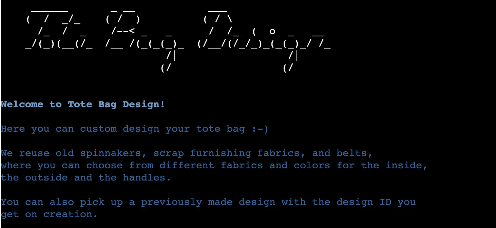

# Design Your Own Tote Bag

Design Your Own Tote Bag is an interactive command line application that aims to give people a possibility to design a custom made tote bag out of reused material. The app iterates through a number of questions regarding fabrics and colors and, based on the user responses, a unique tote bag is created and presented to the user at the end.

The app is targeted towards people who are interested in sustainable solutions and design and use their own bag when shopping or carrying things around. 

Design Your Own Tote Bag will come in handy for those who want a unique tote bag that they have designed themselves. The inspiration comes from my daughter's small business that sews tote bags from old spinnakers, scrap furnishing fabrics and old textile belts.

A link to the live application can be found [here](https://design-your-own-tote-bag.herokuapp.com/), and a link to the repository [here](https://github.com/MarieCHessler/design-your-own-tote-bag).

 

## Table of contents
1. [UX](https://github.com/MarieCHessler/design-your-own-tote-bag#ux)
    * [User needs](https://github.com/MarieCHessler/design-your-own-tote-bag#user_goals)
    * [Owner goals]((https://github.com/MarieCHessler/design-your-own-tote-bag#owner_goals))

2. [Design](https://github.com/MarieCHessler/design-your-own-tote-bag#design)
    * [Color palette](https://github.com/MarieCHessler/design-your-own-tote-bag#color_palette)
    * [Structure](https://github.com/MarieCHessler/design-your-own-tote-bag#structure)

3. [Features](https://github.com/MarieCHessler/design-your-own-tote-bag#features)
    * 

4. [Technology used](https://github.com/MarieCHessler/design-your-own-tote-bag#technology-used)

5. [Testing](https://github.com/MarieCHessler/design-your-own-tote-bag#testing)
    * 

6. [Bugs](https://github.com/MarieCHessler/design-your-own-tote-bag#bugs)
    * 

7. [Deployment](https://github.com/MarieCHessler/design-your-own-tote-bag#deployment)
    * [Heroku](https://github.com/MarieCHessler/design-your-own-tote-bag#heroku)

8. [Credits](https://github.com/MarieCHessler/design-your-own-tote-bag#credits)
    * [Content](https://github.com/MarieCHessler/design-your-own-tote-bag#content)
    * [Special thanks to](https://github.com/MarieCHessler/design-your-own-tote-bag#special-thanks-to)

 

## UX

### User needs
As a user, I would like a program that:
* Is easy to understand and use.
* Has an appealing layout.
* Saves the data in a spreadsheet, so it is possible to return to previous designs.
* Shows me the result at the end of the design process.
* Explains how I can return to a previous design.

### Owner goals
As a program owner, I would like to create a tool that:
* Helps the user to create a tote bag in a unique design.
* Is easy to understand and use and has an appealing look.
* Validates the data to make sure the result is correct and easy to understand.
* Saves the data and can return the design to the user, both straight away and later.

## Design

 

### Color palette
* The colors that have been used in this application were produced by using the Colorama and Termcolor libraries.
    * **Blue** for information, such as the introduction and the information and instructions at the end.
    * **Cyan** for questions to the user.
    * **Green** for comments on choices and final design.
    * **White** is the standard color, which is left unchanged for user input and save messages.
    * **Red** for error messages.
* The colors are chosen to give a good contrast, yet be comfortable for the user's eyes, on a black background. 
* Blue, cyan, and green match each other well, and white is a good complement.
* Red sticks out and therefore is a good choice to have the user react to the message.

### Structure
A structure for Design Your Own Tote Bag was drafted on paper at the beginning of project process, and later improved using Lucidchart, to make it more appealing and easier to understand.

The flowchart shows the different steps and checks the program follows, based on the different choices the user makes along the way.

 

## Features
The features described below have been implemented for the user to have a pleasant experience.

**Introduction, with logo and welcome**
* When starting the program an ASCII ART logo, showing the name Tote Bag Design, appears. This helps the user know that he or she is in the right place. 
* Below the logo there is a headline in bold, welcoming the user, and an introduction with a bit of information about what the company does and what the user can do in the application. With this information, the user is prepared when it is time to make the first choice.

 

**Choice between new and existing design**
* The first choice the user makes is if he or she wants to create a new design or pick up one that has been created earlier. 
* Giving the user this choice is important since he or she may already have a design that he or she is happy with.

 

**New design section**  
In the New design section, the user name is collected for personification and recapture of design. The fabric and color choices the user makes are used to create the design. A design number and unique design ID are created in the background. At the end of the section, the user is presented with the custom-designed tote bag and a unique design ID that can be used to access the design at a later time. 

 

***Name***
* In the first part, the user is asked to enter his or her name. 
* A personalized welcome message with the name appears, to make the user feel special.
* From the first and last name a full name is created and passed to a Google Sheets worksheet called *name* to be stored.
* If the user enters nothing or other characters than letters, an error message appears and the user is returned to the question.
* For incorrectly entered characters, the error message returns what the user has entered and asks him or her to enter a name in letters.

 

***Fabric and color choices***
* In the second part, the user is asked to choose between predefined choices of fabrics and colors for the outside, the inside, and the handles of the tote bag.
* A comment that supports the choice appears, to encourage the user to continue.
* When the choices are made they are passed to a Google Sheets worksheet called *design* to be stored.
* The user is made aware of the choices being saved through messages shown after all the choices are made.
* If the user enters nothing or other choices than the predefined ones, an error message appears, and the user is returned to the question.
* For all the fabric and color choices, the error message returns what the user has entered, shows the valid choices, and asks him or her to enter the choice in letters.

***Design number and ID***
* For the user to be able to access the design at a later time, some kind of identification is needed. This is created from a combination of the user name and the design number.
* The design number is created by collecting the previous design number from the Google Sheets worksheet called *design_no*, incrementing it by one, and sending the new number back to the correct row in the worksheet.
* The user name is collected from the Google Sheets worksheet called *name*, the whitespace is removed, and all letters are made lower case.
* The name and number are combined according to the logic firstnamelastname1 and passed to the Google Sheets worksheet called *unique_id*.
* The user is made aware of the number and ID being saved through messages shown after all the choices are made.